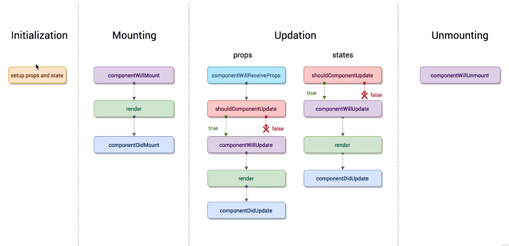

## react渲染过程

1. state 数据

2. JSX 模版


3. 数据 + 模版 生成虚拟DOM（虚拟DOM就是一个JS对象，用它来描述真实DOM）（损耗了性能）['div', {id: 'abc'}, ['span', {}, 'hello world']]


4. 用虚拟DOM的结构生成真实的DOM，来显示 <div id='abc'><span>hello world</span></div>


5. state 发生变化


6. 数据 + 模版 生成新的虚拟DOM （极大的提升了性能）['div', {id: 'abc'}, ['span', {}, 'bye bye']]


7. 比较原始虚拟DOM和新的虚拟DOM的区别，找到区别是span中内容（极大的提升性能）


8. 直接操作DOM，改变span中的内容优点：

   1. 性能提升了。
   2. 它使得跨端应用得以实现。React Native


## 组件中的传值

+ 父组件给子组件传值

  父组件通过属性的方式给子组件传递参数

  子组件通过props接受父组件传过来的参数

  ​

+ 子组件给父组件传值

  子组件要调用父组件传递过来的方法


## Fragment

使用Fragment可以替代最外层的div,

 return中一个div包裹的dom树就是一个jsx

```js
import React, { Component, Fragment } from 'react'

<Fragment>
  <div></div>
  <ul>{this.getTodoItem()}</ul>
</Fragment>
```


## 代码优化

```js
// 1 将事件绑定存储
this.inputToList = this.inputToList.bind(this)

// 代码优化2
getTodoItem() {
  return this.state.list.map((item, index) => {
    return (
      <ListItem del={this.handleDel} content={item} key={index} idx={index} />
    )
  })
}
// jsx中调用
<ul>{this.getTodoItem()}</ul>

// 代码优化3
  // this.setState 可以写成
  // 可以接收一个函数,这个函数需要一个返回值,return一个对象
  // 版本一
  this.setState( ()=>{
    return {
      list: [...this.state.list, this.state.inputDate],
      inputDate: ''
    }
  } )

  // 版本二
  // ES6中,若直接返回一个对象,可去掉return,用一对小括号包裹这个对象
  this.setState( () => ({
    list: [...this.state.list, this.state.inputDate],
    inputDate: ''
  }) )

  // 版本三
  // setState中的函数可以接收一个参数prevState, prevState等价于修改之前的数据,
  // setState还可以接受一个函数作为参数,回调函数,表示第一个函数执行完成后在执行的函数
  prevState <==> this.state
  this.setState( (prevState) => ({
    // list: [...this.state.list, this.state.inputDate],
    list: [...prevState.list, prevState.inputDate],
    inputDate: ''
  }), () => {
    console.log("回调函数")
  }  )
```


## 操作state中的数据

```js
// 删除
  handleDelete(index) {
    // 2 在删除数据的时候不要直接去操作state中的数据,
    // 先将数据拿出来,再操作(就是先拷贝一个副本)
     let list = this.state.list
     list.splice(index, 1)
     this.setState({
       list
     })
  }
```


## propTypes 与 defaultProps

```js
// propTypes
// 每个组件都有props参数,这个参数表示从父组件接收的一些属性
// 在接收参数是,我们改如何对接收的参数做校验,如何定义参数的默认值
// propTypes可以做接收属性的强校验
// 1 引入  脚手架中已自带了prop-types包
import PropTypes from 'prop-types';

// 2 对组件的类型进行强校验
// 意思就是我要对ListItem组件的属性做校验
ListItem.propTypes = {
  test: PropTypes.string.isRequired, // 必须传,且为string类型
  del: PropTypes.func.isRequired, // del接收的属性必须是一个函数,isRequired表示必须传
  idx: PropTypes.number, // idx类型必须是一个number类型
  content: PropTypes.arrayOf(PropTypes.number, PropTypes.string)
  // content类型必须是一个string类型,或者为number类型
}

// defaultProps
// defaultProps表示给属性添加默认值
// 当父组件没有传值得时候,添加默认值
ListItem.defaultProps = {
  test: 'hello world'
}
```


## render函数更新机制

> 当组件中的state或者props发生改变的时候,render函数就会重新执行(重)
>
> 当父组件的render函数被运行时,它的子组件的render都将被重新运行


## ref

```js
<input
    id="insertArea"
    value={this.state.inputDate}
    onChange={this.inputToList}
    // 构建一个ref引用,这个引用叫this.input,指向input对应的dom节点,
    // this.input指向当前的input  DOM
    // 函数的参数便是dom
    // ref帮助我们在react中获取dom
    // 建议不要使用ref
    ref={input => {
       this.input = input
    }}
/>
```


## 生命周期

> 生命周期函数, 是指在某一时刻组件会自动调用执行的函数.



### Mounting

```js
// 在组件即将被挂载到页面的时刻自动执行
componentWillMount(){
  console.log('componentWillMount');
}

/*----------------------------------------------*/

// 组件被挂载到页面之后，自动被执行
componentDidMount() {
  console.log('componentDidMount')
}
```

### Updation

```js
// 组件被更新之前，他会自动被执行
// 翻译: 组件需要被更新么?返回true,则需要;返回false,则不需要
shouldComponentUpdate() {
  console.log('shouldComponentUpdate')
  return true
}
```

+ 更新state

```JS
// 组件被更新之前，它会自动执行，但是他在shouldComponentUpdate之后被执行，
// 如果shouldComponentUpdate返回true它才执行
// 如果返回false，这个函数就不会被执行了
componentWillUpdate() {
  console.log('componentWillUpdate')
}

/*-------------------------------------------------------------------------*/

// 组件更新完成之后，他会被执行
componentDidUpdate() {
  console.log('componentDidUpdate')
}
```

+ 更新props

```js
// 一个组件要从父组件接受参数
// 只要父组件的render函数被重新执行,子组件的这个生命周期函数就会被执行
// 如果这个组件第一次存在于父组件中，不会执行
// 如果这个组件之前已经存在于父组件中，才会执行
componentWillReceiveProps() {
  console.log('child componentWillReceiveProps')
}
```

### Unmounting

```js
// 当这个组件即将被从页面中剔除的时候，会被执行
componentWillUnmount() {
  console.log('child componentWillUnmount')
}
```


## 生命周期函数的使用场景

```js
// 数据更新时(子组件中的props)
// nextProps: 接下来我的props会变化成什么样
// nextState: 接下来我的state会变化成什么样
shouldComponentUpdate(nextProps, nextState) {
  // 我当前组件里 接下来的content 与 之前的props的content的值不一样,
  // 说明组件里的props发生了变化,则组件需要被渲染
  if (nextProps.content !== this.props.content) {
    return true
  } else {
    return false
  }
}
```

```js
// ajax 请求数据
componentDidMount() {
  axios.get('/api/todolist')
    .then(()=>{alert('succ')})
    .catch(()=>{alert('error')})
}
```


